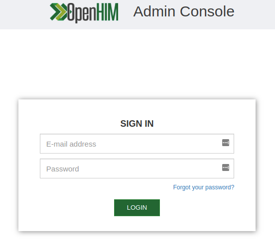
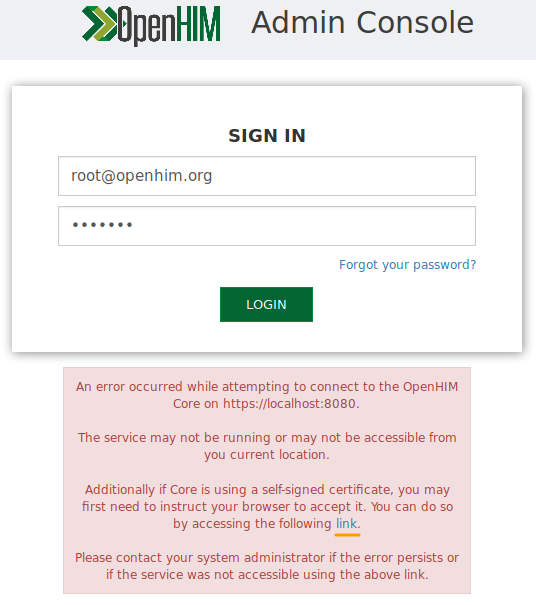
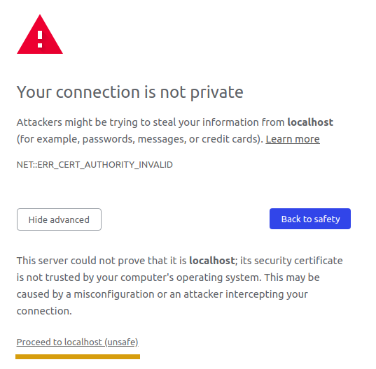
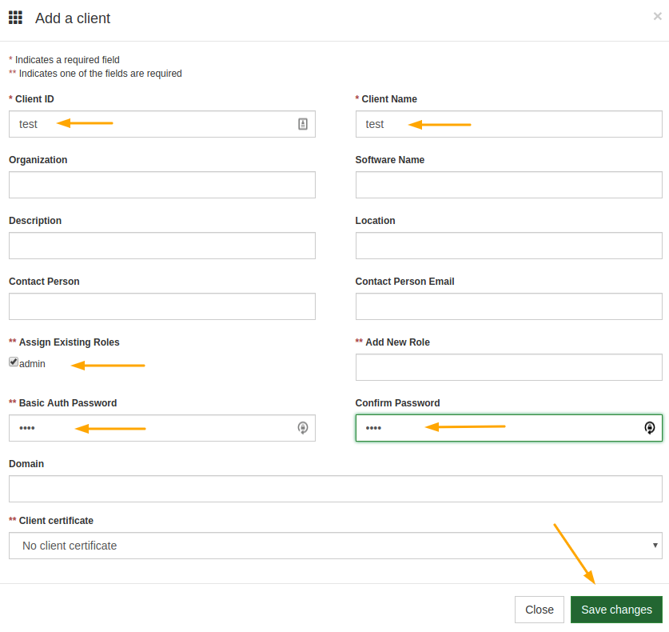

# 

## **OpenHIM SetUp Tutorial**

**TLDR; Watch Linux Tutorial Setup on [YouTube](https://www.youtube.com/watch?v=)**

## Useful Links

http://openhim.org/

https://github.com/jembi/openhim-core-js

https://www.jembi.org/

## Introduction

> Tutorial Purpose: Get local OpenHIM Core and Console instances running on your computer.

The Open Health Information Mediator(OpenHIM) is a middleware component designed to allow data transfer between diverse information systems by routing, orchestrating and translating requests as they flow between systems.

In this tutorial we will be starting up an OpenHIM instance on your local machine and creating client profile to allow client authentication with the OpenHIM Core.

## Prerequisites

This tutorial assumes that you have [docker-compose](https://docs.docker.com/compose/) installed on you computer. The tutorial instructions are Linux based.

[docker-compose install instructions](https://www.digitalocean.com/community/tutorials/how-to-install-docker-compose-on-ubuntu-18-04)

---

## Project Setup

### Step 1 - Creating the `docker-compose` script

Open a terminal and make a directory in which to store a docker-compose script.
Create the file `docker-compose.yml`.


Then copy the setup script below into the file.

```yaml
version: '3'
networks:
  openhim:

services:
  mongo-db:
    container_name: mongo-db
    image: mongo:3.4
    networks:
      - openhim
    volumes:
      - "mongo-data:/data/db"
    restart: unless-stopped

  openhim-core:
    container_name: openhim-core
    image: jembi/openhim-core:5
    restart: unless-stopped
    environment:
      mongo_url: "mongodb://mongo-db/openhim-development"
      mongo_atnaUrl: "mongodb://mongo-db/openhim-development"
      NODE_ENV: "development"
    ports:
      - "8080:8080"
      - "5000:5000"
      - "5001:5001"
    networks:
      - openhim
    healthcheck:
     test: "curl -sSk https://openhim-core:8080/heartbeat || exit 1"
     interval: 30s
     timeout: 30s
     retries: 3

  openhim-console:
    container_name: openhim-console
    image: jembi/openhim-console:1.13
    restart: unless-stopped
    networks:
      - openhim
    ports:
      - "9000:80"
    healthcheck:
     test: "curl -sS http://openhim-console || exit 1"
     interval: 30s
     timeout: 30s
     retries: 3

volumes:
  mongo-data:

```

---

### Step 2 - Starting the OpenHIM

In the terminal, whilst still in the directory containing the `docker-compose.yml` file, run the following command:

```sh
docker-compose up
```

> Include `-d` in the previous command if you want the process to run in the background.

The docker-compose script will start up the OpenHIM-core, OpenHIM-console and a MongoDB instance. All these services communicate with each other over a defined docker network. This network will be important in the next step.

---

### Step 3- Changing OpenHIM default password

On a browser, navigate to `http://localhost:9000`. You will be presented with the OpenHIM Console login page:



Enter the default username and password: `root@openhim.org` : `openhim-password`.

As this is a development environment the SSL certificate is self-signed and cannot be authenticated. Therefore after entering the default credentials a textbox will appear beneath the login button requesting that the user follow a link to allow the browser to accept the self-signed certificate.



Depending on the browser the browser will load a screen indicating that the certificate cannot be validated. To bypass this click the advanced options then click on the link to proceed to the localhost destination.



Finally you will be presented with a screen requiring to reset the default user's password. For this tutorial please set this to `password` for simplicity.

---

### Step 4 - Adding an OpenHIM client

On the OpenHIM Console, navigate to the `Clients` menu option. Under the client's section click the add client button.

In the *Add a client* modal, fill in the following details, Add New Role **admin** (press `Enter` after typing in **admin**), then **Save changes**:

* **Client ID** : test
* **Client Name** : test
* **Basic Auth Password** & **Confirm Password** : test



> The client ID and password are going to be needed later for authenticating requests to the OpenHIM.

---
